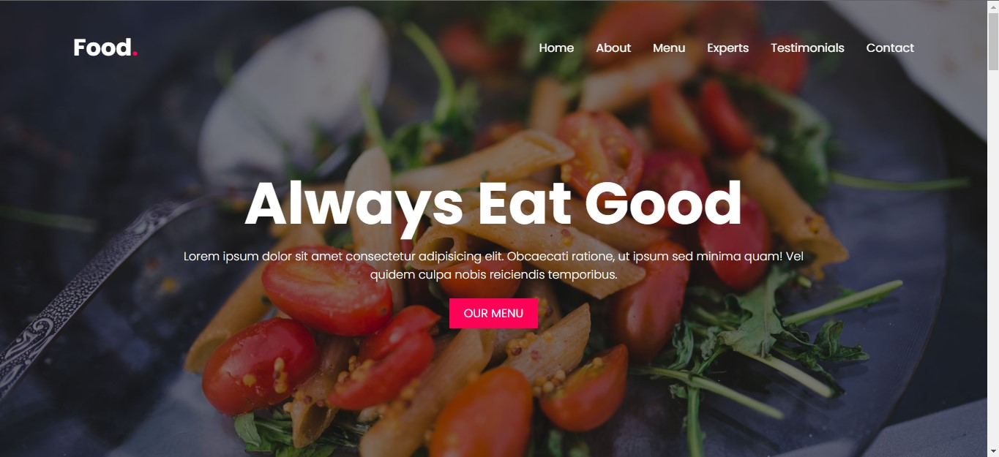
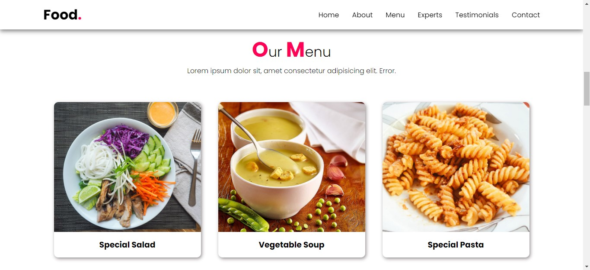
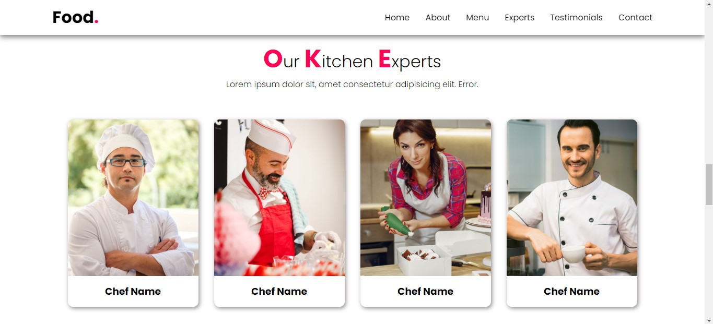
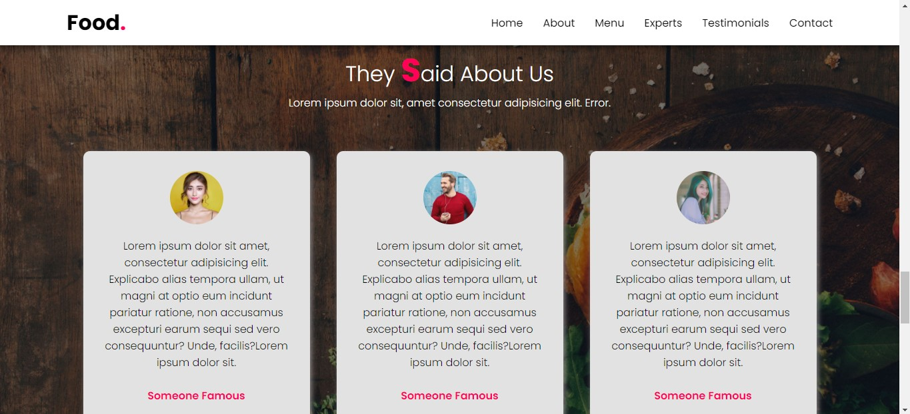
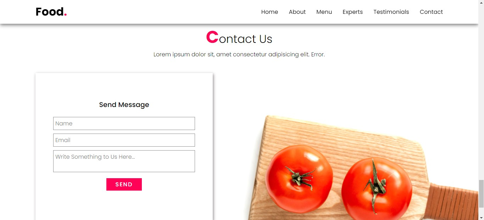

# Food Website

#### If you like my work, please start following this project's author [Syed Ali Jawad](https://github.com/alijawad1511) and don't hesitate to give star⭐ to my project to show your ❤️❤️ and support

# THIS APPLICATION IS HOSTED ON GITHUB. VISIT THE LINK BELOW TO SEE THE PREVIEW

## 🌐 Link
https://alijawad1511.github.io/Food-Website/

## 🛠️ Built With:
- HTML
- CSS
- JavaScript

## 📝 About Project
This is a Food Website of a Restaurant. They can show their Menu, Cooks, and Contact information
of their restaurant. This is built using pure HTML and CSS.

## 🖼️ Output Samples
### Sample No. 1

### Sample No. 2

### Sample No. 3

### Sample No. 4

### Sample No. 5

### Sample No. 6

## 📞 Contact me at:
- [LinkedIn](https://www.linkedin.com/in/alijawad1511)
- [GitHub](https://github.com/alijawad1511)
- [Gmail](mailto:jawad.bukhari1511@gmail.com)
